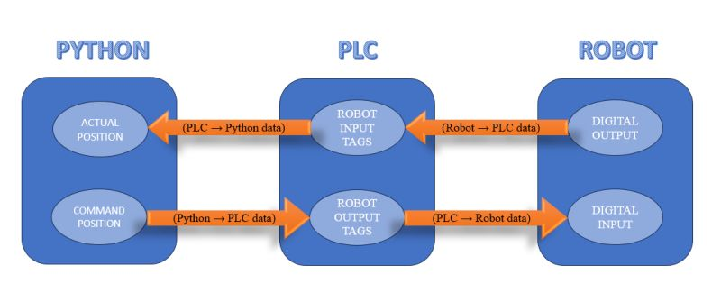

## PLC Configuration and Setup

### Overview

This folder contains the PLC configuration and communication documents between `PC` <-> `PLC` <-> `Fanuc`. The below diagram depicts the data flow and communication flow in the system.

 

There are two ways in which communication taking place in the system.  

1. **Target Joint Config to Fanuc PLC:** 

    - Joint values are calculated for the target `TF` using inverse kinematics in `RoboticsToolbox`. Look [fanuc_model.py](../fanuc_model.py) for more information regarding the use of IK solvers.
    - The computed joint values are converted to `bits` (i.e., 1's and 0's) that is `2 bytes` representation (i.e., used 16 bits).
    - Based on the binary values **virtual tags** in the PLC are modified.
    - Fanuc PLC reads the virtual tags and converts into whole numbers and stores them in the **position registers**.

2. **Joint Config feedback from Fanuc PLC:**
    
    - Current joint values of the robot are read and are stored into Fanuc PLC position register as `feedback`.
    - With the same procedure (as mentioned above) data transfer takes place.
    - The logic to read data is performed at every time step, we have used **background logics** in the Fanuc PLC.

>[!IMPORTANT]   
The above document is the high level overview the entire PLC configuration.  More detailed procedure with appropriate images and code samples can be found in this [PDF](./fanuc_plc_doc.pdf).