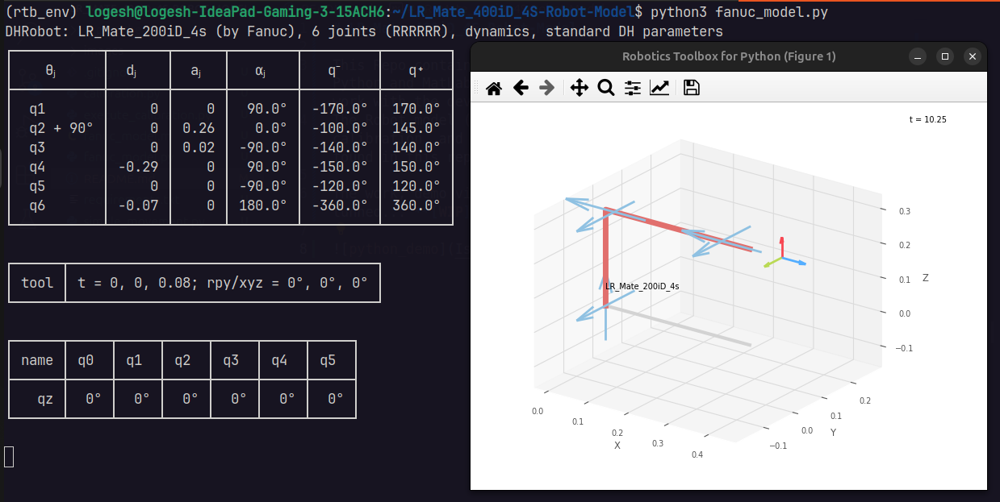
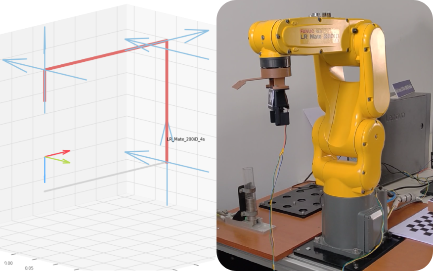

# LR_Mate_200iD_4S-Robot-Model

This Repo contains the Fanuc robot model in Robotic Toolbox using Python and MatLab. The repo contains some additional functions to work with the developed fanuc model.
The Robot model (Python + Matlab), pick and place example, handeye calibration, and LR Mate 200iD 4s control with PLC and python can be found in this repo.

The work, demo video and documentation is still in progress. So stay tunned... **[WIP]**

---

### **Work Done**
- [X] Fanuc model dev using RTB
- [X] PLC configuration for communication between **LAP-PLC-Robot**
- [X] Simple movement script
- [X] Camera Calibration
- [X] Hand - Eye Calibration
- [ ] Pick and place of known object (aruco tagged object)
- [ ] Movement using trajectory planning
- [ ] Grasp using 6D - Pose Estimation

---

### **Installation and Setup**

1. Install the required packages:
   ```
   pip3 install -r requirements.txt
   ```
   > [!NOTE]
   > Normal installation of **OpenCV** will result in issues with **RoboticsToolbox**.<br> To troubleshoot this issue install **Opencv-headless** package while running RTB. For example installation process [click here](./utils/cv2_install.py).

2. PLC Configuration: 
    >[!IMPORTANT]
    For PLC configuration check the this [README.md](./PLC_configurations/README.md) 

3. Gripper Setup:
4. Camera mount Setup

---

### **Fanuc Model**



---

### **Simple movements**

Simple movements like move to coordinate (x, y, z) with (R, P, Y) rotation can be executed using the inbuilt functions in Fanuc model. 

I have provided with some examples for sending move_to commands in [`example_simple_movement.py`](./example_simple_movement.py). Below is the demo video for the given example movement script.

[](https://youtu.be/GiFRFGhvIwU?si=Xxzz2z1uW8odgahF)

---

### **Calibration (Camera + Hand-Eye)**